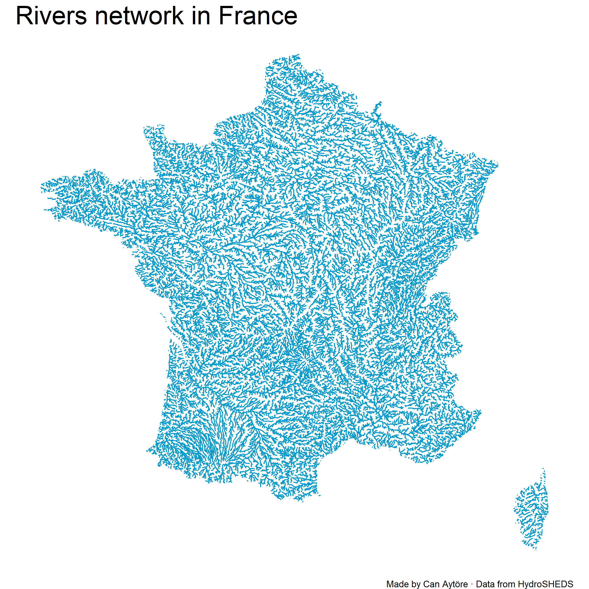

--- 
title: "YOUR TITLE HERE"
author: "Author: YOUR NAME HERE"
date: "Last Update: `r Sys.Date()`"
favicon: "favicon.jpg"
site: bookdown::bookdown_site
---

```{r setup, include=FALSE}
knitr::opts_chunk$set(echo = TRUE)
```

# Get started..

Inspired by [Dominic Royé](https://dominicroye.github.io/en/graphs/geography/)'s maps..

```{r message=FALSE, warning=FALSE}
library(tidyverse)
library(ggtext)
library(sf)
library(rnaturalearth)
```

```{r message=FALSE, warning=FALSE}
countries_eu <- st_as_sf(ne_countries()) %>%
  filter(continent == "Europe") %>%
  select(sovereignt) %>%
  .[[1]]
```

```{r, cache = TRUE}
sf_eu <- list()
for (i in countries_eu) {
  sf_eu[[i]] <- ne_countries(country = i, scale = 'medium',
                       type = 'map_units', returnclass = 'sf')
}
shape_eu <- read_sf("data/HydroRIVERS_v10_eu.shp") 
```

```{r echo=TRUE, message=FALSE, warning=FALSE}
for (i in 1:length(countries_eu)) {
  plot_eu <- shape_eu %>% 
    st_intersection(sf_eu[[i]]) %>%
    ggplot(.) +
    geom_sf(color = "deepskyblue3") +
    labs(
      title = paste0("Rivers network in ", countries_eu[i]),
      caption = "Made by Can Aytöre &middot; Data from HydroSHEDS"
      ) +
    theme_void() +
    theme(
      plot.background = element_rect(fill = "white", color = "white"),
      panel.background = element_rect(fill = "white", color = "white"),
      plot.title = element_markdown(family = "Serif", size = 25),
      plot.caption = element_markdown(family = "Serif")
    )
  ggsave(file.path(paste0(countries_eu[i],".png")), plot = plot_eu, path = "docs", dpi = 300, width = 8, height = 8)
}
```



This plot shows the density of rivers in France. Now, if we want to show which rivers are the most important, we can modify the opacity of the lines depending on their flow:

```{r message=FALSE, warning=FALSE}
for (i in 35:length(countries_eu)) {
  plot_eu <- shape_eu %>% 
    st_intersection(sf_eu[[i]]) %>%
    ggplot(.) +
    geom_sf(mapping = aes(alpha = DIS_AV_CMS), color = "deepskyblue4") +
    labs(
      title = paste0("Rivers network in ", countries_eu[i], " by Flow Size"),
      caption = "Made by Can Aytöre &middot; Data from HydroSHEDS"
      ) +
    theme_void() +
    theme(
      plot.background = element_rect(fill = "white", color = "white"),
      panel.background = element_rect(fill = "white", color = "white"),
      plot.title = element_markdown(family = "Serif", size = 25),
      plot.caption = element_markdown(family = "Serif"),
      legend.position = "none"
    )
  ggsave(file.path(paste0(countries_eu[i],"_by_discharge.png")), plot = plot_eu, path = "docs", dpi = 300, width = 8, height = 8)
}
```


## Get started

```{r}

```


# References {.unnumbered}

# Appendices {.unnumbered}

## About Author {.unnumbered}
